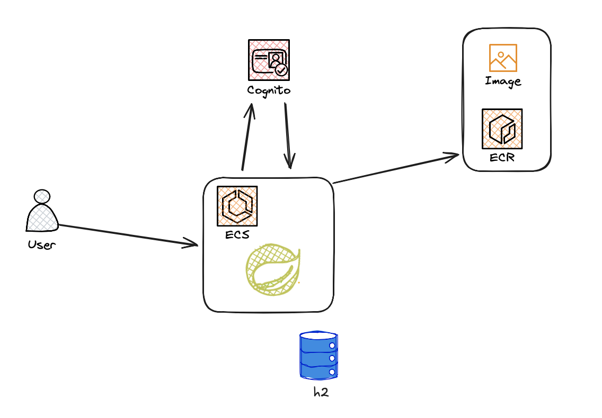
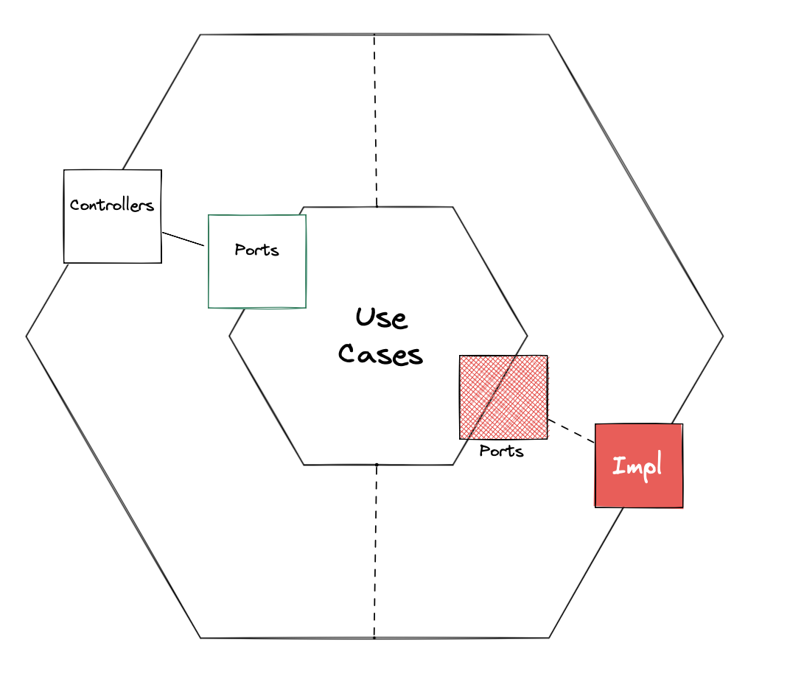

# PósTech-FIAP
## TRABALHO SUBSTITUTIVO DE TECH CHALLENGE

### FiapCar — Spring Boot (Cars, Brands, Sales) + AWS Cognito + H2 + Swagger

API de exemplo para uma loja de carros com **Catálogo (Brand/Car)** e **Vendas (Sale)**.
Autenticação de usuários via **Amazon Cognito** (InitiateAuth, sem MFA), **autorizando apenas as rotas de `Sale`**.
Banco em memória **H2** sobe com esquema e dados via `schema.sql` e `data.sql`. Documentação com **Swagger UI**.

---

## Sumário

- [Arquitetura](#arquitetura)
- [Endpoints](#endpoints)
- [Autenticação (Cognito)](#autenticação-cognito)
- [Executando localmente](#executando-localmente)
- [Desenho da arquitetura do projeto](#desenho-da-Arquitetura-do-Projeto)
- [Desenho da aplicação](#desenho-da-Arquitetura-da-Aplicação)
- [Banco de dados (H2)](#banco-de-dados-h2)
- [CI/CD (GitHub Actions → ECR/ECS/Fargate/Terraform)](#cicd-github-actions--ecrecsfargeteterraform)
- [Mapeamentos & Paginação](#mapeamentos--paginação)
- [Itens não produzidos mas necessários em produção](#itens-que-não-foram-levados-em-conta-mas-seriam-necessários-em-ambiente-produtivo)
---

## Arquitetura

- **Java 21** / **Spring Boot 3.5.x**
- **Spring Web**, **Spring Data JPA**, **H2**, **Validation**
- **springdoc-openapi** (Swagger UI)
- **MapStruct** para mapeamento DTO ↔ Entity
- **AWS Cognito** (SDK v2) para autenticação (USER_PASSWORD_AUTH)
- **Spring Security (Resource Server)** valida **JWT do Cognito** e **protege somente `/sale/**`**
- Infra (opcional): **Docker**, **ECR**, **ECS Fargate**, **ALB**, **API Gateway** (frontend estável), **Terraform**, **GitHub Actions**

---

## Endpoints

Swagger detalhado pode ser encontrado aqui:
[Download Swagger](docs/swagger.yaml)

Uma collection com exemplos válidos pode ser encontrada aqui:
[Download Collection](docs/collections.yaml)

> Base path local (com o `context-path`): `http://localhost:8080/fiapcar`

- **OpenAPI/Swagger**
    - `GET /fiapcar/swagger-ui/index.html`
    - `GET /fiapcar/v3/api-docs`

- **Marca**
    - `GET /fiapcar/brand/all` — lista paginada
    - `GET /fiapcar/brand/{id}` — detalhe por id
    - `POST /fiapcar/brand/` — criacao de marca
    - `PATCH /fiapcar/brand/{id}` — alterar uma marca por id

- **Cliente**
    - `GET /fiapcar/customer/all` — lista paginada
    - `GET /fiapcar/customer/{id}` — detalhe por id
    - `POST /fiapcar/customer/new` — criacao de cliente

- **Carro**
    - `GET /fiapcar/car` — **paginado** e com **filtros** (ex.: `brandId`, `model`, `modelYear`, `color`, `fuelType`, `minPrice`, `maxPrice`, `status`, `page`, `size`, `sort`)
    - `GET /fiapcar/car/{id}` — detalhe
    - `POST /fiapcar/car` — criacao de carro
    - `PATCH /fiapcar/car/{id}` — alterar um carro por id

- **Autenticação (Cognito)**
    - `POST /fiapcar/auth/login` — inicia `USER_PASSWORD_AUTH` (pode retornar `NEW_PASSWORD_REQUIRED`)
    - `POST /fiapcar/auth/new-password` — responde desafio `NEW_PASSWORD_REQUIRED`
    - `POST /fiapcar/auth/refresh` — usa `REFRESH_TOKEN_AUTH`

- **Vendas (protegido por JWT)**
    - `GET /fiapcar/sale/all` — lista (paginada)
    - `GET /fiapcar/sale/{id}` — detalhe
    - `POST /fiapcar/sale/new` — cria venda
    - `POST /fiapcar/salereserved/{salidId}/pay` — finaliza uma venda reservada
    - **Header obrigatório**: `Authorization: Bearer <access_token>`

---

## Autenticação (Cognito)

- Crie um **User Pool** (sem MFA).
- Crie um **App Client** com o fluxo **`USER_PASSWORD_AUTH`** habilitado.
- Se o **App Client** tiver **secret**, o backend calcula `SECRET_HASH` automaticamente.
- **Somente** os endpoints de `sale` exigem token válido. Swagger e demais recursos **abertos**.

### Fluxo básico

1. **Login** → `POST /auth/login`  
   Retorna `id_token`, `access_token`, `refresh_token` (ou `NEW_PASSWORD_REQUIRED` + `session`).
2. **(Se necessário) Troca de senha** → `POST /auth/new-password` usando `session`.
3. **Usar o token** → Enviar `Authorization: Bearer <access_token>` nos endpoints de `sale`.
4. **Refresh** → `POST /auth/refresh` com `refresh_token`.

---

## Executando localmente

### Requisitos

- Java 21
- Maven 3.9+
- (Opcional) Docker
- Uma conta AWS com **User Pool** Cognito

### Rodar

```bash
# compilar
mvn clean install

# executar com profile local
mvn spring-boot:run -Dspring-boot.run.profiles=local
```

### Desenho da Arquitetura do Projeto


## Desenho da Arquitetura da Aplicação


### Funções da app:

- Existem cadastros para **clientes** e **contas** respeitando o padrão de um CRUD
- Endpoint de transferência de valores
- Transactional para efetuar rollback caso tenha problemas ao efetuar uma transação
- Validações de saldo insuficiente, cliente não existente, campos mal preenchidos ou vazios, duplicidade de registros e formatos de campos

### Banco de dados (H2)
- Usa H2 em memória (`jdbc:h2:mem:fiapcarDb`)
- Criação do esquema via `src/main/resources/schema.sql`
- Carga inicial via `src/main/resources/data.sql`
- Console H2: http://localhost:8080/fiapcar/h2
- JDBC URL: `jdbc:h2:mem:fiapcarDb`
- user: `sa
- password: (vazio)
### Esquema
- brand: `brand_id` (PK), `name`, `created_at`, `updated_at`
- car: `car_id` (PK), `brand_id` (FK), `model`, `model_year`, `price`, `status`, etc.
- customer: `customer_id` (UUID PK), `nome`, `email`, `username`, `password`, `created_at`
- sale: `sale_id` (PK), `customer_id` (FK → customer), `car_id` (FK → car), `amount_paid`, `status`, `timestamps`

### CI/CD (GitHub Actions → ECR/ECS/Fargate/Terraform)
- Pipeline padrão:
- Checkout do repositório
- Login no ECR
- Build & Push da imagem (`IMAGE_TAG = SHA do commit)
- Terraform (`infra/) aplica:
- VPC (ou usa subnets/SG existentes)
- ECR (opcional), ECS Cluster, Task Definition, Service (Fargate)
- Secrets necessários no GitHub
- `AWS_ACCESS_KEY_ID`, `AWS_SECRET_ACCESS_KEY` (com permissão em ECR/ECS/CloudWatch/IAM/Terraform S3 se aplicável)
- `ECR_REPOSITORY_URI` (ex.: `577638369685.dkr.ecr.us-east-1.amazonaws.com/fiapcar)
- S3 Bucket existente para state


### Mapeamentos & Paginação
- MapStruct: mapeia `Entity ↔ DTO ↔ Response (ex.: `CarMapper`, `SaleMapper que usa `CarMapper` via `uses = CarMapper.class).
- Paginação: parâmetros padrão Spring Data: `page`, `size`, `sort.
- Resposta de lista é `Page<T> → contém conteúdo e metadados (`totalElements`, `totalPages`, etc).

### Itens que não foram levados em conta, mas seriam necessários em ambiente produtivo
- Máscaras para dados sensíveis
- Alertas para dynatrace e demais ferramentas sobre erros do sistema ou falha de comunicação com cognito e banco de dados
- Banco de dados a parte da app para melhor segurança, controle, estabilidade, boas práticas e escalonamento
- Maior cobertura nos testes unitários
- Variaveis de ambiente para alguns valores da aplicação
- Parametrização da JVM com xmx e xms
- Dockerização da aplicação para usabilidade em cluster k8s
- Api Gateway entre o cliente final e a aplicação